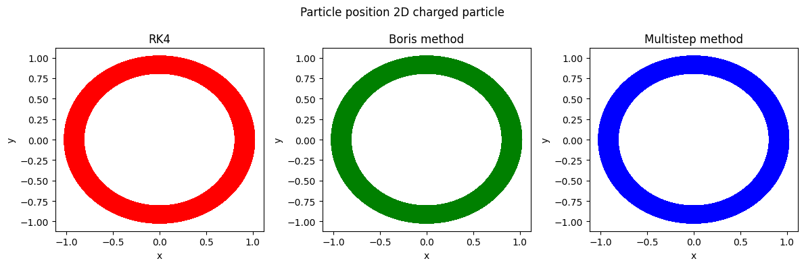
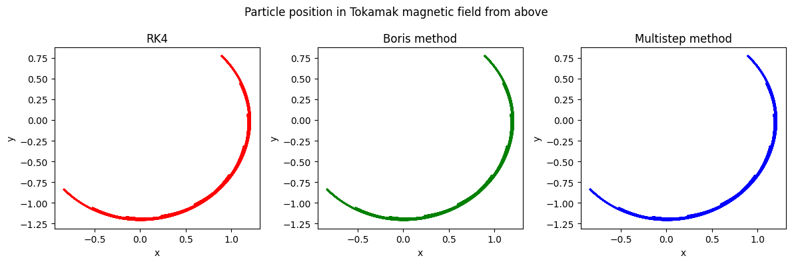
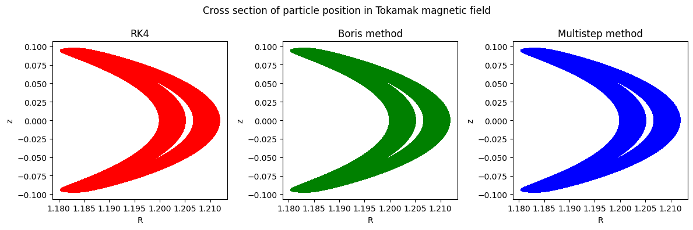
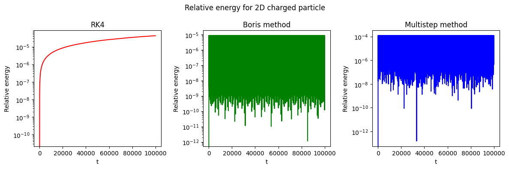
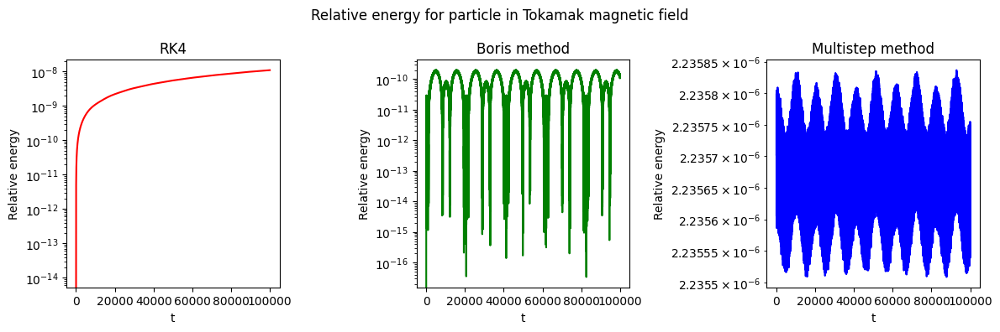

# Simulation of a particle in a tokamak magnetic field

This project models the trajectories of a charged particle in two different magnetic fields. One of them is the magnetic field we can find inside a running Tokamak. A Tokamak is an experimental machine aiming to achieve controlled nuclear fusion energy. The trajectories are calculated using three different numerical methods. For each method I will look at the particle trajectories. I will also study how the methods conserve the particles energy.

---

### Objectives

- Understand and implement the RK4 method, the Boris method and a 9-point symmetric multistep method.
- Run simulations with given intial conditions and visualize the results.

### Key results

#### Trajectories:

*Figure 1: The trajectory of a particle in the given 2D magnetic field*
 
*Figure 2: The trajectory of a particle in a Tokamak magnetic field. Seen from above.*

*Figure 3: The trajectory seen from a cross section perspective of the particle in a Tokamak magnetic field. We observe the expected banana trajectory*

#### Energy conservation:

*Figure 4: Relative energy for each time step. We observe that the Boris method and the symmetric multistep method conserves energy, while RK4 does not.*

*Figure 5: Relative energy for each time step. Boris method and symmetric multistep method does conserve energy as expected. RK4 does not conserve energy.*

### Academic Context

This was a **group project** in the course **TMA4215 Numerical mathematics** at NTNU (Fall 2025).

The learning objectives of the project was to implement different numerical methods learnt in the lectures of the course. The final submission also included experiments with calculation speed and order of convergence, but are excluded in this repository. 

Language: **English**

Collaborators:

- [andrea14](https://github.com/andrea14)

---

## Requirements:

- Python 3.x
- "numpy"
- "matplotlib"
- "scipy"

